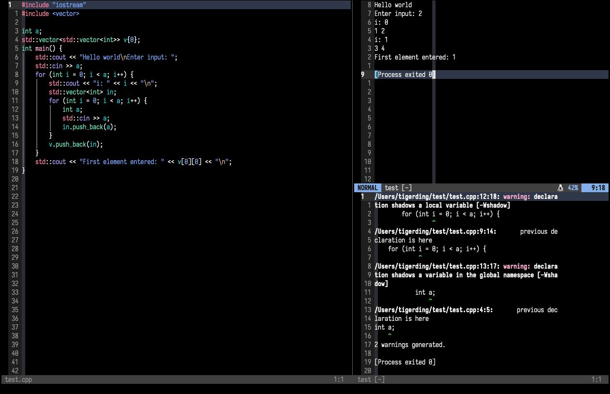

<h1 align='center'>TargetFile.nvim</h1>
<p align="center"><sup>A code runner plugin written and configured in lua for Neovim</sup></p>



### 🚀 Installation

- Install with [lazy.nvim](https://github.com/folke/lazy.nvim)

    ```lua
    {
      'zerogtiger/TargetFile.nvim',
      dependencies = { 'numToStr/FTerm.nvim' },
    },
    ```


- Install with [packer.nvim](https://github.com/wbthomason/packer.nvim)
    ```lua
    use {
      'zerogtiger/TargetFile.nvim',
      requires = {
        'numToStr/FTerm.nvim', -- required for floating window option
      },
    },
    ```

### `</>` Quick start

`TargetFile` comes with sane defaults. However, it does not ship with any filetype specific compilation or execution commands.

To set up compilation and execution commands for a file type, pass in the `supported_languages` field into `setup()` function. Reference the placeholder strings in the list below
- `%fp`: full file path
- `%fen`: full file path without file extension
- `%fben`: full file path without file extension with build directory
- `%fdb`: full file path without file name or extension with build directory
- `%fn`: file name (without extension)

```lua
require("TargetFile").setup({
  supported_languages = {
    ['.cpp'] = {                                    -- file extension
      name = 'C++',                                 -- Language name
      ext = '.cpp',                                 -- file extension
      compile_cmd = 'g++ -g -Wshadow -Wall -Wextra
        --std=c++17 %fp -o %fben',                  -- compile shell command
      execute_cmd = '%fben',                        -- execution shell command
    },
    ['.c'] = {
      name = 'C',
      ext = '.c',
      compile_cmd = 'gcc -g -Wshadow -Wall -Wextra -std=c99 %fp -o %fben',
      execute_cmd = '%fben',
    },
    ['.rs'] = {
      name = 'Rust',
      ext = '.rs',
      compile_cmd = 'rustc %fp',
      execute_cmd = '%fen',
    },
  },
})
```

### ⚒️ Configuration

Other configuration options and default values are shown below.
```lua
require("TargetFile").setup({
  ---Default size of window in lines/columns for horizontal/vertical splits
  ---(only application to non-float options)
  ---@type string
  window_size = 60,         

  ---Default window location (1: north; 2: east; 3: south; 4: west; 5: float)
  ---@type number
  window_location = 2,

  ---(see above) File extensions and the corresponding compile/execute commands
  ---@type table
  supported_languages = {},

  ---Leader key that triggers TargetFile keybindings. Set to <space>\ by default
  ---@type string
  leader = [[<space>\]],
})
```

### ⌨️ Commands & Usage
`TargetFile` will use the path of the first buffer you open and treat that as the file to be compiled/executed by default. 

- `:TFPath` (`<TF_leader>sp`): shows stored path

- `:TFResetPath` (`<TF_leader>rp`): resets the stored path to the current active buffer's file path

- `:TFCustomPath` (`<TF_leader>mp`): prompts for a custom path to a file to be used as the stored path

- `:TFExecute` (`<TF_leader>e`): attempts to execute the file (or compile executable) that's stored in the path

- `:TFCompile` (`<TF_leader>c`): attempts to compile the file stored in the path

- `:TFCompileExecute` (`<TF_leader><space>`): attempts to compile, and if successful, execute the file stored in the path

- `:TFPreviewWindow` (`<TF_leader>sw`): shows a short preview of the popup window

- `:TFResetWindow` (`<TF_leader>rw`): resets the window to the default size and location

- `:TFWindowSize` (`<TF_leader>ss`): shows the current specified window size

    Note: Window sizes are measured in rows for horizontal splits, and columns for vertical splits

- `:TFResetWindowSize` (`<TF_leader>rs`): resets the default window size

- `:TFCustomWindowSize` (`<TF_leader>ms`): prompts for a custom window size

- `:TFWindowLocation` (`<TF_leader>sl`): shows current window location

- `:TFResetWindowLocation` (`<TF_leader>rl`): resets the default window location

- `:TFCustomWindowLocation` (`<TF_leader>ml`): prompts for a custom window location

### Todo
- [ ] default resets to user specified default
- [ ] Preview milisecodns
- [ ] Debug window settings
- [ ] Default window size for horizontal and vertical splits
- [ ] Close compile window automatically
- [ ] Swap locations of compile/execution windows
- [ ] Vim Docs
